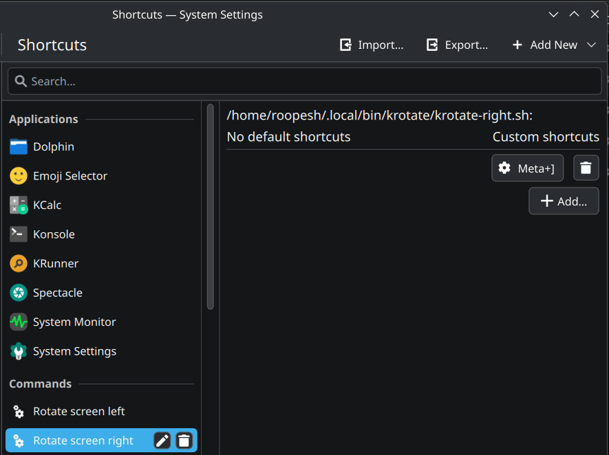

# KRotate

KDE plasma 6 Keyboard shortcut scripts to rotate whole screen to left or right. It works by reading current rotation state in the file `$HOME/.config/krotate.rc` and doing appropriate rotation for a given keystroke. This script is based on `kscreen-doctor`.

## install
1. Clone repo:
```bash
git clone --depth 1 https://github.com/roopeshor/krotate ~/.local/bin/krotate
```

2. Goto `System settings -> Keyboard -> Shortcuts`.
3. To create rotate left shortcut, `Add New -> Command or script`. In the `command` field, provide full path for the above scripts (`~/.local/bin/krotate/krkrotate-left.sh`), and some name
4. Add your required shortcut like `Meta+]`
5. Repeat same to add rotate right shortcut (command file: `~/.local/bin/krotate/krotate-right.sh`)


